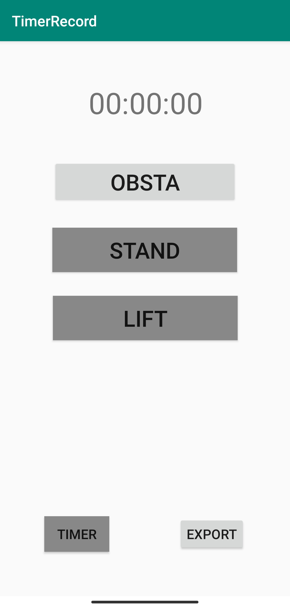
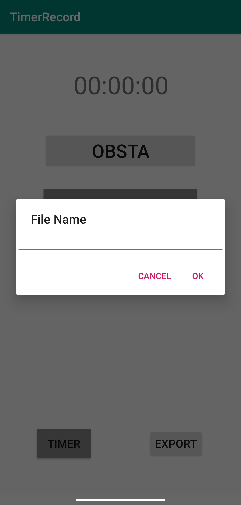

# TimeRecorder
Android app to record time during mobile experiment
- Record the time during temporary events (obstacles, OBSTA), and fixed events (STAND, LIFT)
- Tap `Timer` to start the timer, and then tap events (`OBSTA`, `STAND`, `LIFT`) to record events. Tap `Timer` again to stop the timer. Tap `Export` and enter file name to save data.
- Data are saved in `Downloads > TimerRecord` directory with the given `FILE_NAME` while exporting (`<FILE_NAME>.csv`)
- Data are stored in CSV format (`<EVENT>,<SECONDS>\n`)
    - sample
    ```
    TIMER_START,0
    OBSTACLE,6
    OBSTACLE,13
    STAIR_START,16
    STAIR_STOP,19
    TIMER_STOP,23
    ```
- User interfaces , 


## Requirements
1. AndroidStudio (or any IDE which support Android)
2. Android SDK (AndroidStudio will directly download this for you)


## How to run?
1. Build the project first (Make Tool)
2. Run the app

